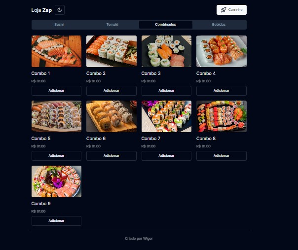
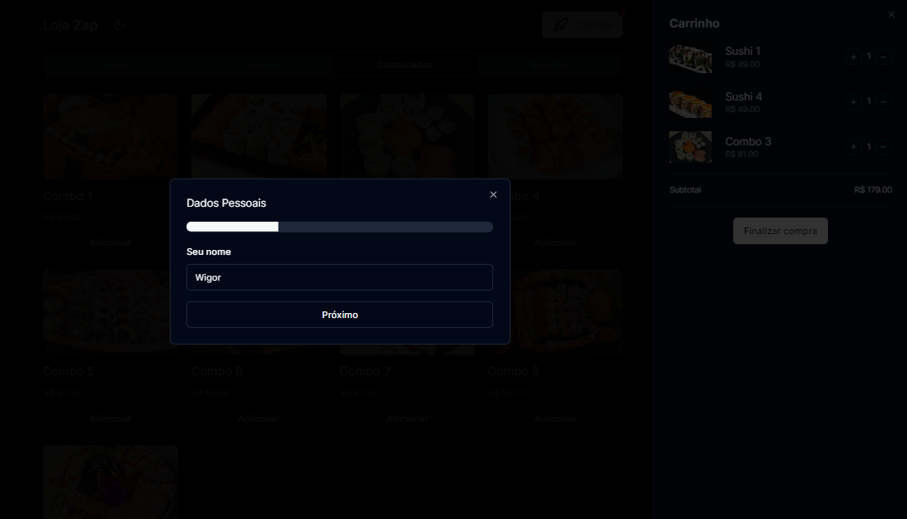
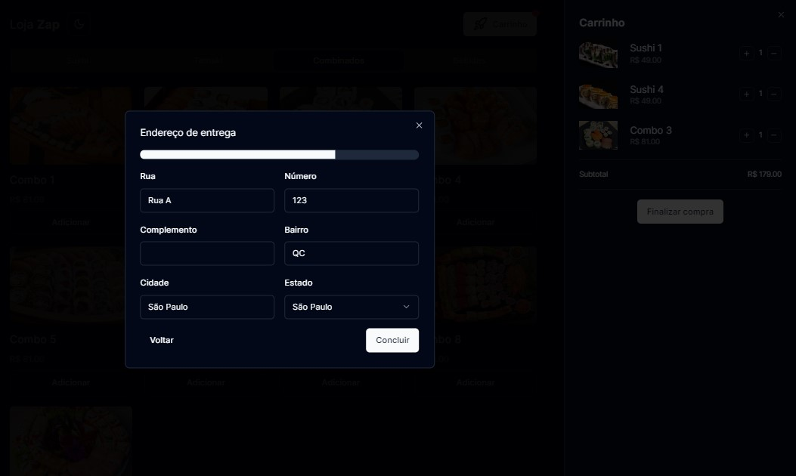
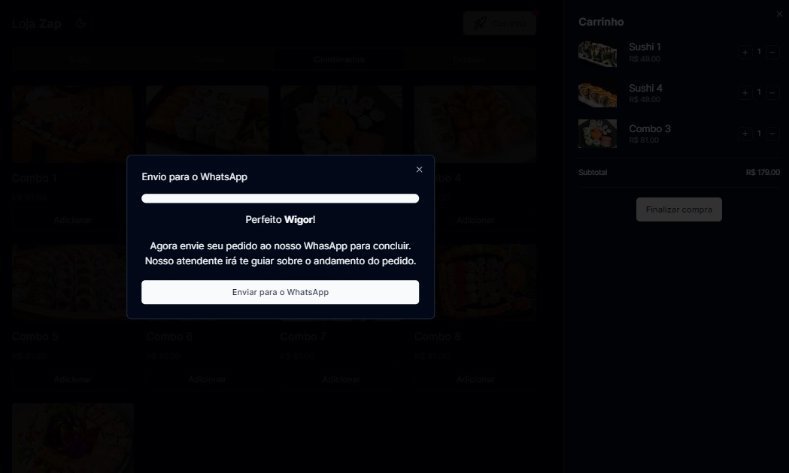

# Projeto Loja Virtual Shadcn

Este é um projeto de exemplo que inclui várias funcionalidades relacionadas a uma loja online, como adicionar produtos ao carrinho, realizar o checkout e enviar o pedido por WhatsApp.

### Home

 

### Tema Light

 

### Carrinho

 

### Checkout name

 

### Checkout Endereço

 

### Checkout Finalizar pedido

 

## Funcionalidades Principais

- **Adicionar Produtos ao Carrinho:** Os usuários podem adicionar produtos ao carrinho de compras.
- **Checkout em Etapas:** O processo de checkout é dividido em etapas, incluindo informações do usuário e endereço de entrega.
- **Envio por WhatsApp:** Após concluir o checkout, os usuários podem enviar o pedido por WhatsApp para finalizar a compra.

## Tecnologias Utilizadas

- **React:** Biblioteca JavaScript para construção de interfaces de usuário.
- **Zustand:** Biblioteca de gerenciamento de estado.
- **Next.js:** Framework React para construção de aplicativos da web.
- **Tailwind CSS:** Framework CSS para criação de layouts responsivos.
- **Lucide:** Biblioteca de ícones SVG.
- **Shadcn:** O shadcn é uma coleção de componentes reutilizáveis.

### Instalação das Dependências:

```bash
npm install
# ou
yarn install
```
